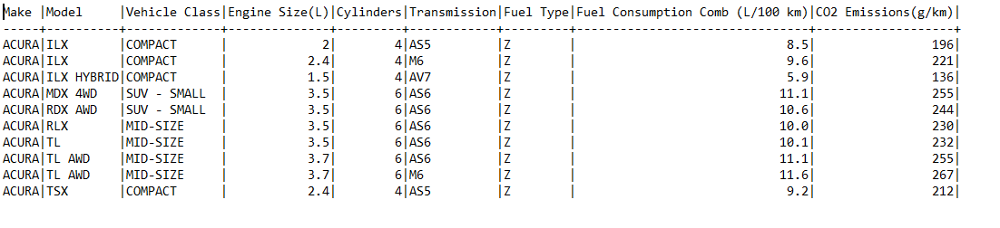
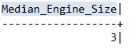
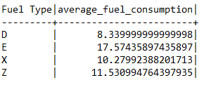
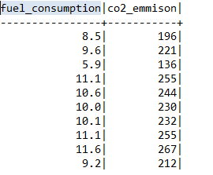
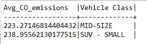
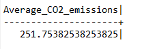
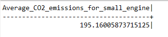
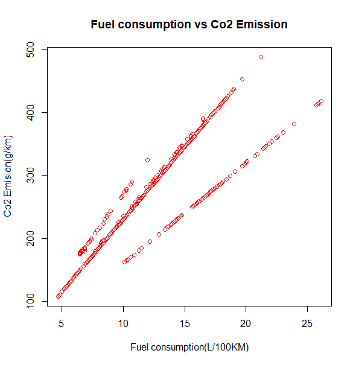

# Vehicle-Co2-Emmision

## Project Background

I volunteered for a public policy advocacy organization in Canada, and my colleague asked me to help her draft recommendations for guidelines on CO2 emissions rules.
After researching emissions data for a wide range of Canadian vehicles, she would like me to investigate which vehicles produce lower emissions.

### The Data

* Make" - The company that manufactures the vehicle.
* Model" - The vehicle's model.
* Vehicle Class" - Vehicle class by utility, capacity, and weight.
* Engine Size(L)" - The engine's displacement in liters.
* Cylinders" - The number of cylinders.
* Transmission" - The transmission type: A = Automatic, AM = Automatic Manual, AS = Automatic with select shift, AV = Continuously variable, M = Manual, 3 - 10 = the number of gears.
* Fuel Type" - The fuel type: X = Regular gasoline, Z = Premium gasoline, D = Diesel, E = Ethanol (E85), N = natural gas.
* Fuel Consumption Comb (L/100 km)" - Combined city/highway (55%/45%) fuel consumption in liters per 100 km (L/100 km).
* CO2 Emissions(g/km)" - The tailpipe carbon dioxide emissions in grams per kilometer for combined city and highway driving.

+ The data comes from the Government of [Canada's](https://open.canada.ca/en) open data [Source](https://app.datacamp.com/workspace/w/30c9e0f9-a189-4ebe-bea1-afa18b857eb6#you-have-access-to-seven-years-of-co2-emissions-data-for-canadian-vehicles-source)

We will be using the 2023 dataset:

### Challenge:

We would like to gain insights on the type of vehicles that have lower CO2 emissions. Include:

* What is the median engine size in liters?
* What is the average fuel consumption for regular gasoline (Fuel Type = X), premium gasoline (Z), ethanol (E), and diesel (D)?
* What is the correlation between fuel consumption and CO2 emissions?
* Which vehicle class has lower average CO2 emissions, 'SUV - SMALL' or 'MID-SIZE'?
* What are the average CO2 emissions for all vehicles? For vehicles with an engine size of 2.0 liters or smaller?
* Any other insights you found during your analysis?

### Steps:

* Imported the raw data into Excel. This was in a CSV format.
* Cleaned the data in Excel by removing unwanted columns and rows.
* Exported the cleaned CSV file.
* Imported the CSV file into R and SQL.
* Created visualization and insights on the project.

## SQL

#### Checked my dataset

* Median Engine Size:

* Average fuel consumption per fuel type 

* First ten rows of fuel consumption and CO2 emissions. 
* This is to be use in calculating correlation between them.

* Vehicle types with lower average CO2 emissions(SUV -SMALL OR MID-SIZE)

* Average CO2 emissions for all vehicles

* Average CO2 emission for small engines

## R

* Corellation

* Scatter plot to show the corellations between Fuel consumption and CO2 emissions.

## Insights:

* Diesel fuel has the lowest average fuel consumption at 8.3, while ethanol has the highest average fuel consumption at 17.5.

* Premium gasoline has the highest average fuel consumption among the gasoline fuel types at 11.5.
 
* There is a strong positive correlation (0.9) between fuel type and average CO2 emissions, which means that as fuel consumption increases, so does CO2 emissions.

* Midsize cars have lower average CO2 emissions than small SUVs, with midsize cars emitting 223.271 and small SUVs emitting 238.95 on average.

* Vehicles with smaller engine sizes (less than or equal to 2.0 liters) emit less CO2 on average than vehicles with larger engine sizes, with the average CO2 emissions for small engine vehicles being 195.16

## Recommendations:

If you are looking for a fuel-efficient vehicle with lower CO2 emissions, consider vehicles that run on diesel fuel or regular gasoline, as they have lower average fuel consumption and CO2 emissions than other fuel types.
Consider purchasing a midsize car instead of a small SUV if you want to reduce your carbon footprint, as midsize cars emit less CO2 on average than small SUVs.
If you are interested in reducing your CO2 emissions, consider purchasing a vehicle with a smaller engine size (less than or equal to 2.0 liters), as these vehicles emit less CO2 on average than vehicles with larger engine sizes.
It is important to note that there are many other factors to consider when purchasing a vehicle, such as safety, reliability, and cost, in addition to fuel consumption and CO2 emissions. 

Therefore, it is recommended to do additional research and consult with a professional before making a purchasing decision.

### Good luck!

